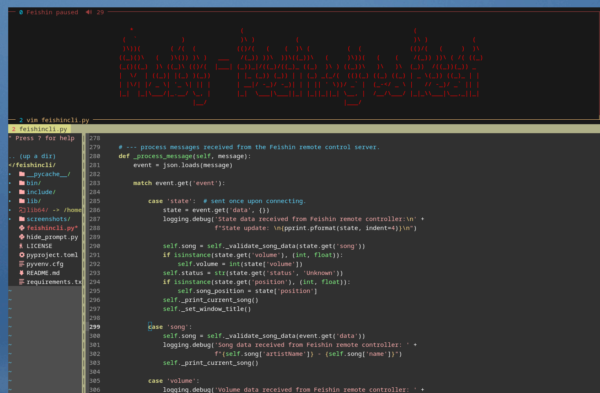
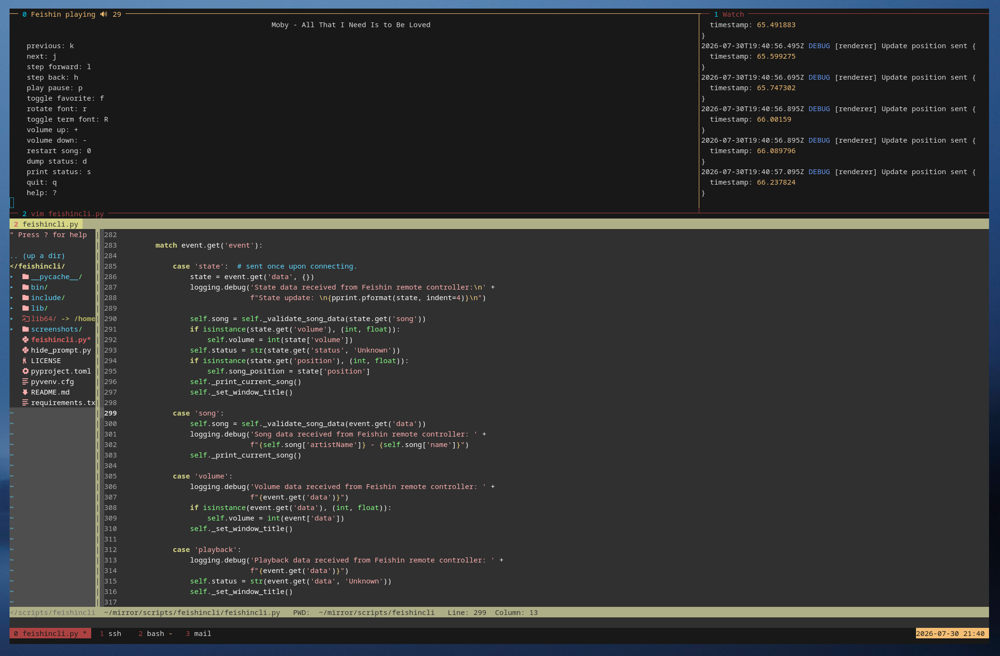
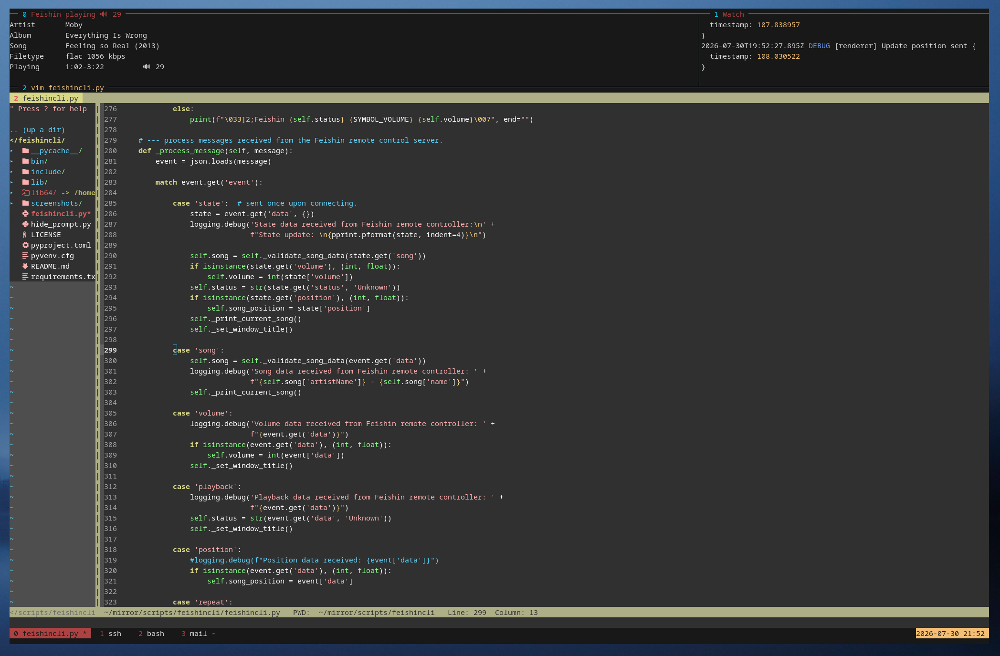
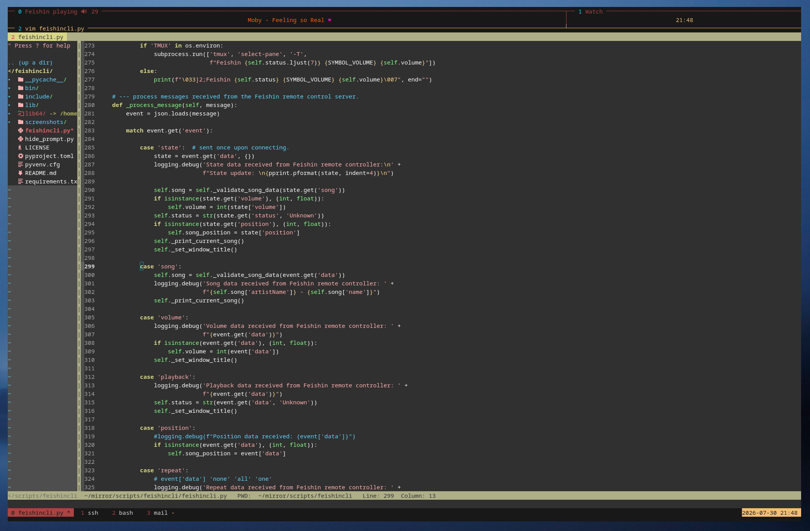

# Feishincli

Simple command line interface (cli) for Feishin media player.  
Written in Python.  

Works with Feishin:  
<https://github.com/jeffvli/feishin/>  

Uses the remote control server build into Feishin.  
Works when running Feishin locally, but can also be used to monitor and control a remote instance.  

Tested and created for Feishin version 1.15.1 on Arch Linux.  
Tested on some other Linux distributions, as well as Windows 11, not tested on MacOS.  
Please let me know if you encounter any issues.  

This script is intended to be run in a corner of a multi-paned terminal window.  
See screenshots.

License: GPL-3.0  

## Features

 - Displays current song using Figlet font of choice.
 - Volume control ( + / - )  
 - Play / Pause ( p )  
 - Previous / Next ( k / j )  
 - Toggle Favourite ( f )  
 - Print status ( s )  
 - Help / all options ( ? )  
 - Quit ( q )  

## Screenshots

   

## Installation

Make sure Feishin and Python are installed.  

### Virtual environment (recommended)

To install in a virtual environment clone this repository and run:  

    python3 -m venv .
    bin/pip install .

### System-wide dependency installation

Clone the repository or download just the .py file and install the dependencies:  

    pip install prompt_toolkit pyfiglet websockets

Or if that fails as it does on most modern systems, use your application manager to install them:  

using apt:  

    sudo apt install python3-prompt_toolkit python3-pyfiglet python3-websockets

using pacman:  

    sudo pacman -S python-prompt_toolkit python-pyfiglet python-websockets

using dnf:  

    sudo dnf install python3-prompt_toolkit python3-pyfiglet python3-websockets

## Configuration

1.  In the Feishin (gui) client enable the remote control server:  
    Feishin -> settings -> window -> remote ( as of version 1.15.1 )  
    Note the username and password.  
2.  Edit the .py file and supply with the correct username and password.  
    (Around line number 35.)  
3.  When connecting to a remote Feishin instance: change the hostname.  
4.  Optionally change the keybindings to match your preference.  
5.  There are some customisation options (starting at around line 70).  
    These are turned off by default.

## Run

From the virtual environment:  

    bin/python ./feishincli.py

And if you installed the python dependencies globally:  

   python3 feishincli.py

or  

    chmod +x feishincli.py  # (once)
    ./feishincli.py

If Feishin is not already running the script will attempt to start Feishin, otherwise 
it will connect to a running instance. (as long as the remote control server is running and 
username and password are correctly set.)

## Acknowledgements

Thanks to jeffvli and the Feishin contributors for their amazing project.

